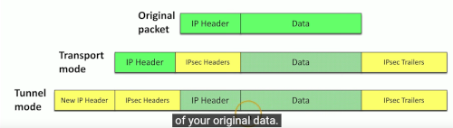

# IP Internet Protocol

### TCP Transmission Control Protocol
- Connection oriented (formal connection setup and close)
- 'Reliable' delivery, can recover from errors and manage out-of-order packets
- Sending device receives an acknowledgment, and the absence of this will result in the data being resent. Uses exponential backoff, so if the first RTO (retranmission timeout) expires, the next one is twice as long. On linus the max retransmission limit is 15 attempts, in other impls 4 to 10.
- flow control - receiver can tell sender to speed up/slow down transmission.

### UDP User Datagram Protocol
- No setup, close down, acknowledgement etc. 
- Can't therefore guarantee delivery, no error recovery, no resending, no flow control.

### IP address and port number
- IPv4 socket
    - consists of server IP address, protocol, server application port number
    - and client IP address, protocol, client port number
- Non-ephemeral port numbers (from 0 to 1023) 'permanent' or 'well-known' port numbers
    - usually on a server or service.
- Ephemeral ports (1024 to 65535) 'temporary' ports.
- TCP port 80 is a different port to UDP port 80

### Well-known port numbers
- FTP 
    - tcp port 20 (active mode data)
    - tcp port 21 (control)
    - authenticates with username and password
    - full file functionality (list, add, delete, rename etc.)
- SSH
    - tcp port 22
    - encrypted communication link
    - sftp (secure version of ftp) also port 22
- Telnet
    - tcp port 23
    - unencrypted, similar function to SSH
- SMTP
    - tcp port 25, plain-text
    - tcp port 587, encrypted using TLS
    - other email protocols like IMAP and POP3
- DNS
    - Resolving FQDN's into IP addresses
    - udp port 53
    - large transfers of data between DNS servers uses tcp/53
- DHCP
    - Dynamic Host Configuration Protocol
    - automated config of ip address, subnet mask and other options
    - udp port 67/68
    - dynamic/pooled. A device connecting to a network will get an IP address assigned in real-time from a pool. 
    - each device is given a lease, must renew at set intervals.
    - dhcp reservation
        - addresses associated with MAC address by the DHCP server
- TFTP Trivial File Transfer Protocol
    - udp/69
    - transfer without authentication or overhead.
- HTTP tcp/80 HTTPS tcp/443
    - SSL Secure Sockets Layer or TLS (Transport Layer Security - newer)
- NTP udp/123
    - Network time protocol
    - Every device has its own clock , NTP sychronizes them. (for log files etc.)
    - Usually 1ms tolerance for devies on one network.
- SNMP Simple Network Management Protocol
    - udp/161 
    - i.e. query how much data has been transferred between devices in unit time
    - different versions 
        - Version 1 - single transfer, no encryption
        - Version 2 - multiple transfer, no enc
        - Version 3 - bulk transfers, message integrity, authentication, encryption
    - SNBP trap 
        - notifications sent direct from devices on udp/162
- LDAP Lightweight Directory Access Protocol
    - tcp/389
    - Store and retrieve info in a network directory - info about devices on network, users, usage etc.
- LDAPS same, but secure 
    - tcp/636
- CIFS Common Internet File System (WIN)
    - file sharing, printer sharing 
    - tcp/445
- SYSLOG Standard for message logging
    - udp/514
    - diverse systems, consolidated log
    - used with a SIEM Security Information and Event Manager (central log collector)
    - need a lotttta disk space
- MS-SQL 
    - tcp/1433
- MySQL/MariaDB
    - tcp/3306
- Postgres
    - tcp/5432
- Oracle
    - tcp/1521
- Mongo
    - tcp/27017
- Redis
    - tcp/6379
- RDP
    - tcp/3389
    - connect to an entire desktop or just an application
- SIP (VOIP)
    - tcp/5060
    - tcp/5061
    - setup and manage VoIP sessions
    - extend voice communication
        - video conferencing
        - instant messaging
        - file transfer
         

# Other useful protocols

### ICMP Internet Control Messaging Protocol

- Text messaging for your network devices, not used for data transfer
- Carried by IP but distinct from TCP and UDP
- Used by 'ping'

### GRE Generic Routing Encapsulation

- The tunnel between 2 endpoints - they appear to be directly connected to each other
- No encryption - use VPN for this
- Concentrator - Encyption/decryption access device - actual physical appliance - ASIC

### IPSec (Internet Protocol Security)

- Security for OSI layer 3 - authentication and encryption for every packet
- Confidentiality and integrity/anti-replay : encryption and packet-signing
- Very standardized : common to use multi-vendor implementations.
- 2 core protocols:
    - Authentication Header (AH)
    - Encapsulation Security Payload (ESP)

### Internet Key Exchange (IKE)

- Agree on encryption/decryption keys, without sending key across network
- Builds a security association
- Phase 1 
    - Use Diffie-Hellman to create a shared secret key
    - udp/500
    - ISAKMP (Internet Security Association and Key Management Protocol)
- Phase 2
    - Include encapsulated data over ESP tunnel

    - Tunnel mode more common, as the new IP Header refers only to the concentrator, and
    the original destination is hidden - no unencypted meta-data about packet

### Network communication

- Unicast - one station sending info to one other
    - one-to-one
    - web surfing, file transfers
    - Doesn't scale optimally for real-time streaming media (one to many)
- Multicast - delivery of info to interested systems
    - One to many-of-many
    - multimedia, stock exchange updates, dynamic routing updates
    - very specialized, difficult to scale across large networks
- Anycast - single IP address has multiple paths to 2 or more endpoints
    - one to one-of-many
    - configure the same anycast address on different devices
    - looks like any other unicast address
    - dns is a good example - closest dns server responds
- Broadcast - send info to everyone at once
    - one-to-all
    - scope limited to local broadcast domain, can't send to entire internet
    - routing updates and ARP requests

