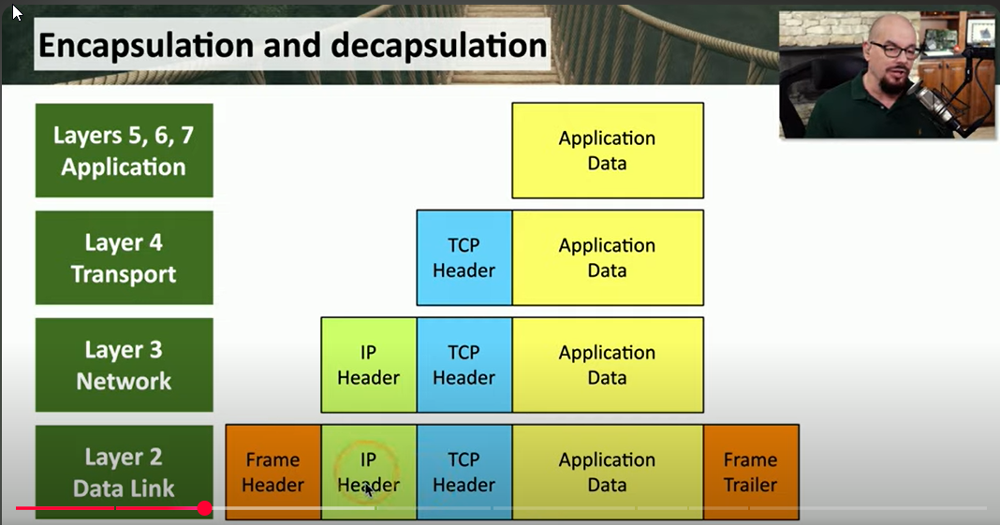
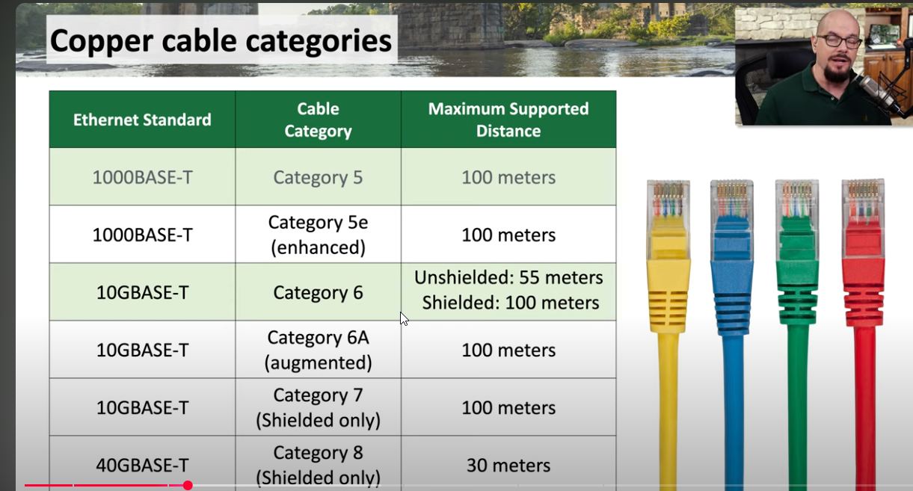
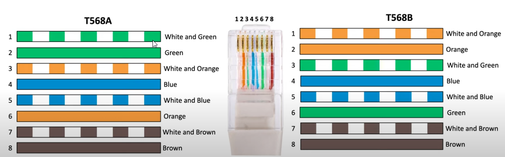

# OSI Model
-  Open Systems Interconnection Reference Model. Unique protocols at every layer.
-  Mnemonic: "All People Seem To Need Data Processing"

### Layers
7: Application  
6: Presentation  
5: Session  
4: Transport  
3: Network  
2: Data-link  
1: Physical  

### Layer 1: Physical
Concerned with signaling, cabling, connectors (no protocols) - check connections, swap adapter cards
Working with : physical cable, looking at EM transmission across wireless

### Layer 2: Data-link
Data Link Control (DLC) protocols / switching layer
- MAC (Media Access Control) address on Ethernet : communication between cards
Working with : Switch forwarding, MAC addresses
Transmission unit : frame, used by ethernet

### Layer 3: Network
Routing layer - layer associated with IP addresses
Unit of communication : Frame 
Working with: IP addresses
Transimission unit : packet, used by TCP or UDP

### Layer 4: Transport
Post office layer - TCP (Transmission Control Protocol) and UDP (User Datagram Protocol)
Working with: TCP and UDP protocols and the port numbers associated with these

### Layer 5: Session Layer
Communication Management between devices - start, stop, restart  
Control protocols, tunneling protocols
Working with: Tunnelling or setting up sessions between hosts

### Layer 6: Presentation Layer
Encryption/decryption
Character encoding
Working with: Encryption

### Layer 7: Application Layer
This is where you come in 
Working with: Code, Browser

## Maximum Transmission Unit (MTU)
The largest group of data that can be sent across a connection without fragmenting.
Staying within the MTU minimizes overhead of chopping up data and reassembling.

---

# Network Topologies
- Star/ Hub and Spoke - one central device
- Ring Networks (used in MAN and WAN networks) - data can avoid a break in the circle
by looping back in the opposite direction
- Bus network - single cable runs through a floor with a branch for each device - breaks can create
segmentation or complete failure
- Mesh network - many/all nodes connected to many/all others, common with IOT devices
- Hybrid network - combination of some/all of the above

# Network Types
- ### Peer to peer
    - Low cost
    - Easy to deploy (no server)
    - Difficult to administer
    - Difficult to secure
- ### Client/server
    - No client/client communication
    - High performance
    - Easy to maintain - one central configuration point
    - Cost (hardware needed) monetary and space
- ### LAN 
    - Local is relative - building or group of buildings
    - Fast communication - 802.11 wireless and ethernet
- ### MAN Metropolitan Area Network
    - Geographically dispersed buildings/installations
    - Used by local government, as they control the right-of-way to install fibre
- ### WAN
    - Connects LANs over distance
    - Much slower than LANs

### Storage
    - NAS (Network Attached Storage) - file level access - entire file needs to be overwritten
    - SAN (Storage Area Network) - more like local file access
    - both require high network throughput, and usually require a dedicated network

### MPLS (Multi Protocol Label Switching):
    - Packets through the WAN have a Label
    - Routing decisions are Easy
    - Allow any kind of traffic - packet/frame etc.

### mGRE (Multipoint Generic Router Encapsulation)
    - Used extensively for Dynamic Multipoint VPN (DM-VPN)
    - Common on CISCO routers
    - VPN builds itself/ remote sites communicate to each other
    - Tunnels are built dynamically, depending on demand, using a dynamic mesh

### Software Defined WAN (SD-WAN)
    - WAN built for the cloud
    - Individual nodes on the network connect individually to services in the cloud

# LAN Demarcation Point (demarc)
- The point at which responsibility for the network switches to external provider
- Network Interface Unit (NIU) - device that determines the demarc
- Smartjack
    - More than a simple Interface
    - Can be a circuit card in a chassis
    - Contains diagnostic equipment enabling external provider to troubleshoot
    - Has indicators visible to prem side of demarc : alerts, status indicators etc.

# Virtual Networks
If 100 physical servers are collapsed into one physical unit, what happens to the network?
- Network Function Virtualization (NFV)
- Manage from the hypervisor
- Routing, switching, load balancing, firewalls : all Virtual

### Hypervisor : Virtual Machine Manager (VMM)
- Hardware Management (CPU, network, security)
- Single Pane of Glass
- Virtual switches
- Virtual network interface cards (VNICs)

# Satellite Networks
Starlink, in LEO. Can have up to 250ms latency each direction. 50 mbit/s upload, 3mbit/s download
Work off line-of-sight in 2Ghz band, so 'rain fade' a factor.

---

# Copper connections
Bandwidth limited by physics, cheap and easy to maintain, often found in local WAN
- DSL (Digital Subscriber Line) and ADSL (Asymmetric Digital Subscriber Line) - speed in > speed out
Usually limited to 2 miles from CO (Central Office). Can get 200mbit/s down and 20mbit/s up, faster if closer to CO.
- Cable Broadband. DOCSIS : Data over Cable Service Interface Specification. 1000Mbits down, 50 Mbits/s up
- Fibre: Expensive, hard to repair. Long range, large capacity. Wavelength division multiplexing, SONET rings
Actual transmission speed = ~0.7c

- Twisted Pair connections - twist helps to reduce interference. 4 pairs in a cable. Pairs have different twist rates

- Coaxial Cabling - commonly used for TV.
- Twin-axial cabling - similar, but 2 separate wires inside. Full duplex, only 5m range with 10gig ethernet.
Low cost.

# Structured cabling standards - ISO/IEC 11801
- T568A and T568B 
    - 8 conductors 100-ohm based twisted pair cabling (ethernet cables)
    - A and B standards have a different set of colours.
    - A and B are incompatible, and can't terminate against each other.

  
